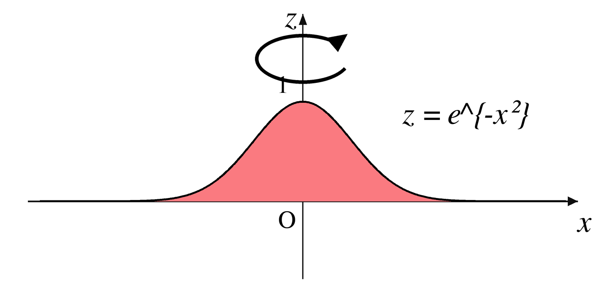

# 理論記事の執筆パターン

数学的に厳密な技術記事では、この構成を使う。

## 推奨構成

1. 問題設定
2. 記法と準備
3. 基準モデル
4. 導出（段階的に説明）
5. リスク項目・限界
6. 実務上の含意
7. まとめ

## 文体ルール

- 数式の前に、使う記号を一度ずつ定義する。
- 近似式と厳密式を分けて示す。
- 前提は箇条書きなどで明示する。
- 何がヘッジ・相殺され、どの残余リスクが残るのかを書く。
- 密度の高い長文より、短く組み合わせやすい式を優先する。

## 数学図の挿入

サンプル図: `../assets/math-gaussian-surface-sample.png`

数学記事では、式だけで形や直感が伝わりにくい箇所に概念図やグラフを入れる。

- 図は定義や直感説明の直後、導出に入る前、または読者が関数の形を確認したくなる箇所に置く。
- 図の前に「この図で何を見るか」を 1 文で説明する。
- 図の直後に、軸、記号、色、曲線、面積、回転などが数式のどの要素に対応するかを書く。
- 軸ラベル、式、凡例、キャプションは本文の記号と一致させる。
- 既存画像を使う場合は、余白を整え、本文の幅で読みやすいサイズにする。
- 新しく図を作る場合は Python + Matplotlib を優先し、使えない環境では Pillow、SVG、または既存画像で代替する。
- 画像編集や圧縮が必要な場合は、Pillow、ImageMagick、sharp、pngquant、oxipng のうち既存環境で使えるものを使う。

Markdown 例:

```md
$z=e^{-x^2}$ は $x=0$ で最大値を取り、左右対称に減衰する。次の図では、この曲線を $z$ 軸のまわりに回転させる直感を示す。



赤い領域は $x$ 軸上の断面を表し、回転矢印はこの断面を $z$ 軸のまわりに回して曲面を考える操作を表す。
```

## 定量ファイナンスでよく使う節

- 確率過程の定義
- PnL 分解
- リスク分解（拡散・ジャンプ・流動性）
- 制約を考慮した最適化
- ストレス市場での失敗モード
